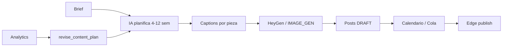

# Brand Agent

Orquestador de campañas multi-semana. **No genera diseño propio** — delega en conectores y escribe copy alineado a tu marca.

## Flujo



## UI

`/dashboard/agent`

1. **Perfil de marca** — voz, tono, audiencia, keywords, banned words, ejemplos
2. **Nueva campaña** — brief, horizonte (4 o 12 semanas), posts/semana, plataformas
3. **Revisar estrategia** — analiza métricas y propone cambios

## API

### `POST /api/agent/run`

```json
{
  "brief": "Lanzamiento verano, tono cercano, 3 posts/semana IG+TikTok",
  "platforms": ["INSTAGRAM", "TIKTOK"],
  "horizonWeeks": 4,
  "postsPerWeek": 3,
  "scheduleStart": "2026-07-01T10:00:00.000Z"
}
```

Requiere plan **Agent** (`brandAgent` feature).

### `POST /api/agent/revise`

```json
{ "lookbackDays": 28 }
```

### `GET /api/agent/runs`

Historial de ejecuciones con `planJson` y `resultJson`.

### `GET/PUT /api/brand/profile`

Perfil de marca del workspace.

## MCP

- `run_brand_agent` — mismo que API run
- `revise_content_plan` — revisión estratégica
- `get_brand_profile` / `update_brand_profile`

## Videos async

HeyGen devuelve `PENDING` + `externalId`. El cron `poll-videos`:

1. Poll status en HeyGen API
2. Descarga MP4 → Supabase Storage
3. Crea `MediaAsset` y adjunta al post (`meta.postId`)

## Degradación elegante

Si falta HeyGen → solo captions + imagen (si IMAGE_GEN configurado).

Si falta IA → error claro; no hay fallback heurístico en el agente completo (solo captions assistant).

## Proveedor de IA

| `AI_PROVIDER` | Variable | Ejemplo `AI_MODEL` |
|---------------|----------|-------------------|
| `openrouter` | `OPENROUTER_API_KEY` | `deepseek/deepseek-chat-v3-0324` |
| `openai` | `OPENAI_API_KEY` | `gpt-4o-mini` |
| `anthropic` | `ANTHROPIC_API_KEY` | `claude-3-5-sonnet-20241022` |

OpenRouter usa la API compatible OpenAI en `https://openrouter.ai/api/v1`. Ver [openrouter.ai/models](https://openrouter.ai/models).

## Modelo de datos

- `BrandProfile` — 1:1 workspace
- `AgentRun` — cada ejecución con plan/result JSON
- `GeneratedAsset` — assets de conectores vinculados a posts

Migración: `006_brand_agent_connectors.sql`
